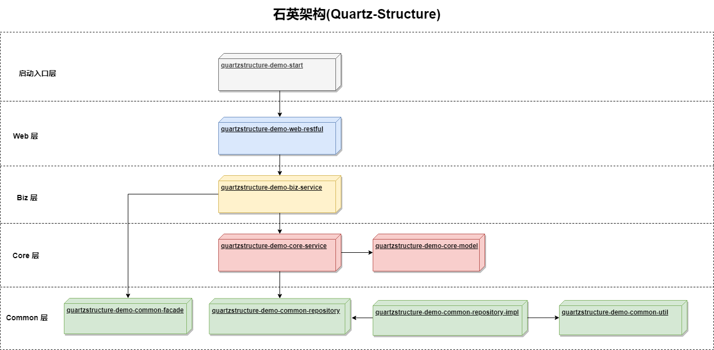

# Quartz-Structure (石英架构) 

-----

### 介绍

一款由传统MVC架构向DDD模型过渡的中间架构。 更加符合实际开发场景。

### 使用

1、本地安装
```shell
mvn clean
```
```shell
mvn install
```

执行命令
具体参数可以执行替换
```shell
mvn archetype:generate -B -DgroupId=com.openquartz -DartifactId=quartzstructure-demo -Dversion=1.0.0-SNAPSHOT -Dpackage=com.openquartz  -DarchetypeArtifactId=quartzstructure-framework-archetype-web -DarchetypeGroupId=com.openquartz.quartzstructure -DarchetypeVersion=1.0.0
```

生成的项目架构有：

-  web-restful : 管理端。负责鉴权等以及各种管理端接口Controller 
-  biz-service :主要负责核心领域的调度。RPC调用协议转换。Job、MQ等消息接收。
-  core : 核心领域相关
    - core-model : 领域模型
    - core-service : 领域服务
-  common : 基础层
    - common-facade :  RPC对外的门面
    - common-dal : 数据存储相关
    - common-repository : 领域仓储API
    - common-repository-impl : 领域仓库实现
    - common-util : 基础工具设施
    - common-integration : 集成服务;外部协议接口调用、MQ协议层输出封装。主要职责：领域防腐 
- start : 服务启动

运行完成后生成架构依赖
